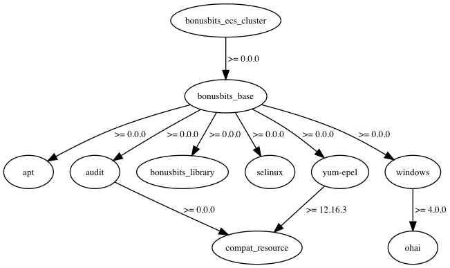

# AWS ECS Cluster Chef Cookbook and CloudFormation Template

# Purpose
Deploy an Autoscaling group of EC2 Instances with ECS Agent installed and Joined to ECS Cluster.

# Prerequisites
* VPC with Public (If Using ALB) and Private subnets
    * [Example Template](https://github.com/bonusbits/cloudformation_templates/blob/master/infrastructure/vpc.yml)
* Internet Access from EC2 Instance
    * [Example NAT Gateway Template](https://github.com/bonusbits/cloudformation_templates/blob/master/infrastructure/nat-gateway.yml)
    * [Example VPN BGP Template](https://github.com/bonusbits/cloudformation_templates/blob/master/infrastructure/vpn-bgp.yml)
    * [Example Sophos UTM 9 Template](https://github.com/bonusbits/cloudformation_templates/blob/master/infrastructure/utm9.yml)

# Launcher
Click this button to open AWS CloudFormation web console with the Template URL automatically entered. 

# CloudFormation
Public S3 Link:  
[https://s3.amazonaws.com/bonusbits-public/cloudformation-templates/cookbooks/bonusbits-ecs-cluster.yml](https://s3.amazonaws.com/bonusbits-public/cloudformation-templates/cookbooks/bonusbits-ecs-cluster.yml)

The [CloudFormation Template](https://github.com/bonusbits/bonusbits_ecs_cluster/blob/master/cloudformation/bonusbits-ecs-cluster.yml)  the following:

1. Create Autoscale Group for Frontend Web Server in private network for HA not Scaling (Currently)
2. Adds the EC2 Instance to the appropriate security groups
3. Create own Security Group
4. Create IAM Instance Profile Role
5. Create Cloudwatch CPU Alarm for Autoscale Group
6. UserData
    Installs some basic packages needed for bootstrapping
    1. cfn-init
    2. aws-cfn-bootstrap
    3. cloud-init
    4. git
7. Cloud Init (cfn-init)
    1. Configure CFN Hup and Auto Reloader Hook Conf
    2. Setup and Execute Chef Zero
        1. Install Chef Client from internet
        2. Create Chef Configuration Files
        3. Download bonusbits_ecs_cluster cookbook from Github
        4. Triggers Chef Zero run
    3. Run DNS Update Script (Optional)
    4. Warm EBS Volume  

# Cookbook
1. Install some basic packages
1. Adjust Sudoers secure path to include */usr/local/bin*
2. Install ECS Agent
3. Install and configure CloudWatch Logs Agent
4. Create node info script

# Cookbook Dependencies

